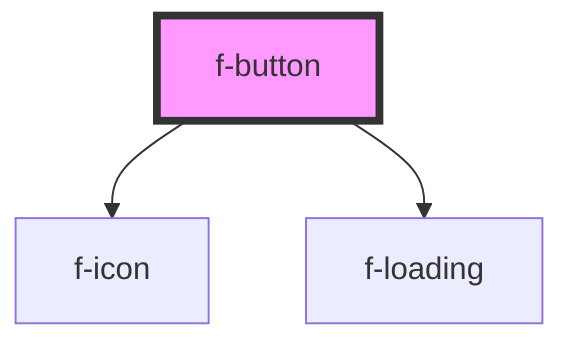

# f-button

<!-- Auto Generated Below -->

## Properties

| Property     | Attribute    | Description                             | Type                                                                               | Default         |
| ------------ | ------------ | --------------------------------------- | ---------------------------------------------------------------------------------- | --------------- |
| `disabled`   | `disabled`   | disabled state of button                | `boolean`                                                                          | `false`         |
| `hasLoader`  | `has-loader` | does the button have a loader displayed | `boolean`                                                                          | `false`         |
| `iconConfig` | --           | config for icon on button               | `IIconConfig`                                                                      | `undefined`     |
| `size`       | `size`       | size of button                          | `"large" \| "medium" \| "small"`                                                   | `'medium'`      |
| `text`       | `text`       | text for button                         | `string`                                                                           | `undefined`     |
| `type`       | `type`       | type of button                          | `"button" \| "reset" \| "submit"`                                                  | `'button'`      |
| `uuid`       | `uuid`       | uuid for button                         | `string`                                                                           | `undefined`     |
| `variant`    | `variant`    | variant of button                       | `"action" \| "destructive" \| "ghost" \| "naked" \| "progressive" \| "regressive"` | `'progressive'` |

## Events

| Event           | Description | Type               |
| --------------- | ----------- | ------------------ |
| `buttonClicked` |             | `CustomEvent<any>` |

## Dependencies

### Depends on

- [f-icon](../f-icon)
- [f-loading](../f-loading)

### Graph

----------------------------------------------

*Built with [StencilJS](https://stenciljs.com/)*
