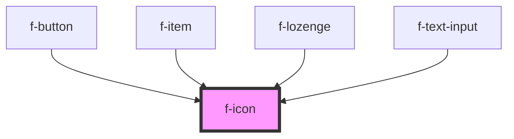

# f-icon

<!-- Auto Generated Below -->

## Properties

| Property     | Attribute | Description               | Type          | Default     |
| ------------ | --------- | ------------------------- | ------------- | ----------- |
| `iconConfig` | --        | config for icon component | `IIconConfig` | `undefined` |

## CSS Custom Properties

| Name             | Description       |
| ---------------- | ----------------- |
| `--f-icon-color` | Color of the icon |
| `--f-icon-size`  | Size of the icon  |

## Dependencies

### Used by

 - [f-button](../f-button)
 - [f-item](../f-item)
 - [f-lozenge](../f-lozenge)
 - [f-text-input](../f-text-input)

### Graph

----------------------------------------------

*Built with [StencilJS](https://stenciljs.com/)*
