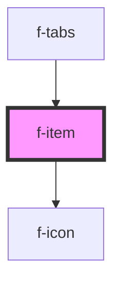

# f-item

<!-- Auto Generated Below -->

## Properties

| Property | Attribute | Description    | Type         | Default     |
| -------- | --------- | -------------- | ------------ | ----------- |
| `item`   | --        | model for item | `IItemModel` | `undefined` |

## Events

| Event          | Description               | Type               |
| -------------- | ------------------------- | ------------------ |
| `itemSelected` | emits item being selected | `CustomEvent<any>` |

## Dependencies

### Used by

 - [f-tabs](../f-tabs)

### Depends on

- [f-icon](../f-icon)

### Graph

----------------------------------------------

*Built with [StencilJS](https://stenciljs.com/)*
