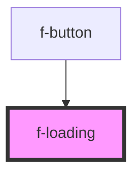

# f-loading

<!-- Auto Generated Below -->

## Properties

| Property   | Attribute  | Description                                        | Type                             | Default     |
| ---------- | ---------- | -------------------------------------------------- | -------------------------------- | ----------- |
| `inverted` | `inverted` | inverted used for displaying on darker backgrounds | `boolean`                        | `false`     |
| `size`     | `size`     | size of loader                                     | `"large" \| "medium" \| "small"` | `'large'`   |
| `variant`  | `variant`  | variant of loading                                 | `"spinner" \| "vbar"`            | `'spinner'` |

## Dependencies

### Used by

 - [f-button](../f-button)

### Graph

----------------------------------------------

*Built with [StencilJS](https://stenciljs.com/)*
