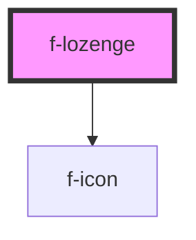

# f-lozenge

<!-- Auto Generated Below -->

## Properties

| Property     | Attribute | Description                 | Type          | Default     |
| ------------ | --------- | --------------------------- | ------------- | ----------- |
| `content`    | `content` | the content for the lozenge | `string`      | `undefined` |
| `iconConfig` | --        | config for icon             | `IIconConfig` | `undefined` |

## Dependencies

### Depends on

- [f-icon](../f-icon)

### Graph

----------------------------------------------

*Built with [StencilJS](https://stenciljs.com/)*
