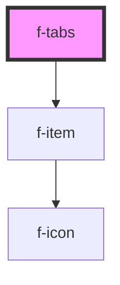

# f-tabs

<!-- Auto Generated Below -->

## Properties

| Property      | Attribute     | Description         | Type                         | Default        |
| ------------- | ------------- | ------------------- | ---------------------------- | -------------- |
| `items`       | --            | array of itemModels | `IItemModel[]`               | `undefined`    |
| `orientation` | `orientation` | orientation of tabs | `"horizontal" \| "vertical"` | `'horizontal'` |

## Dependencies

### Depends on

- [f-item](../f-item)

### Graph

----------------------------------------------

*Built with [StencilJS](https://stenciljs.com/)*
