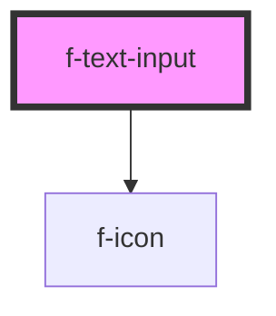

# f-text-input

<!-- Auto Generated Below -->

## Properties

| Property       | Attribute       | Description                             | Type                                                                                                                                                   | Default     |
| -------------- | --------------- | --------------------------------------- | ------------------------------------------------------------------------------------------------------------------------------------------------------ | ----------- |
| `disabled`     | `disabled`      | is text input disabled (optional)       | `boolean`                                                                                                                                              | `false`     |
| `errorMessage` | `error-message` | error message for text input (optional) | `string`                                                                                                                                               | `undefined` |
| `helperText`   | `helper-text`   | helper text for text input (optional)   | `string`                                                                                                                                               | `undefined` |
| `initialValue` | `initial-value` | initial value of text input (optional)  | `string`                                                                                                                                               | `undefined` |
| `labelText`    | `label-text`    | label/placeholder text for text input   | `string`                                                                                                                                               | `undefined` |
| `required`     | `required`      | required state of text input            | `boolean`                                                                                                                                              | `false`     |
| `type`         | `type`          | type of text input                      | `"date" \| "datetime" \| "datetime-local" \| "email" \| "month" \| "number" \| "password" \| "search" \| "tel" \| "text" \| "time" \| "url" \| "week"` | `'text'`    |
| `uuid`         | `uuid`          | uuid for text input                     | `string`                                                                                                                                               | `undefined` |

## Dependencies

### Depends on

- [f-icon](../f-icon)

### Graph

----------------------------------------------

*Built with [StencilJS](https://stenciljs.com/)*
